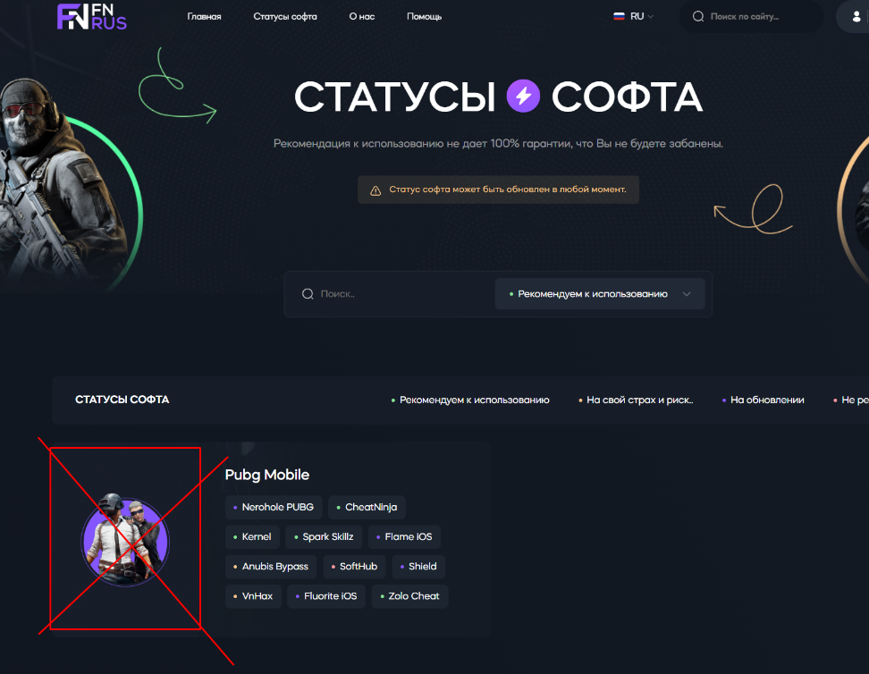
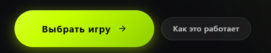
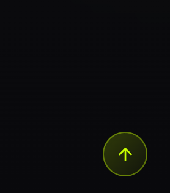
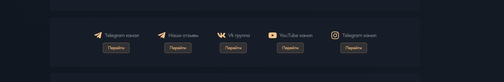
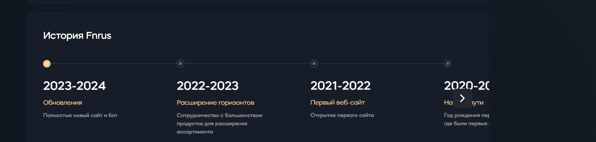
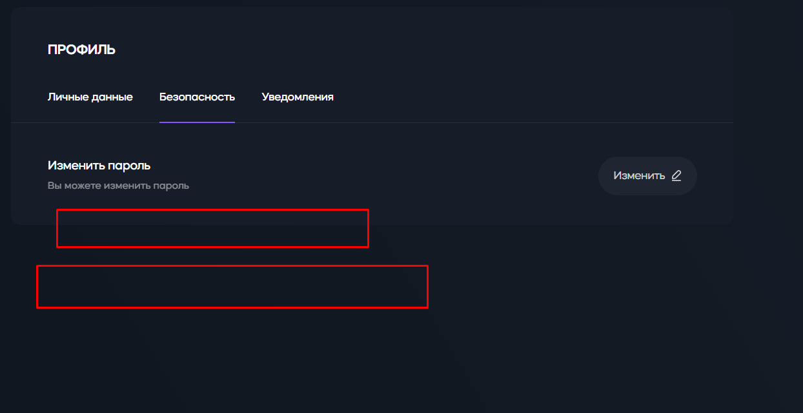
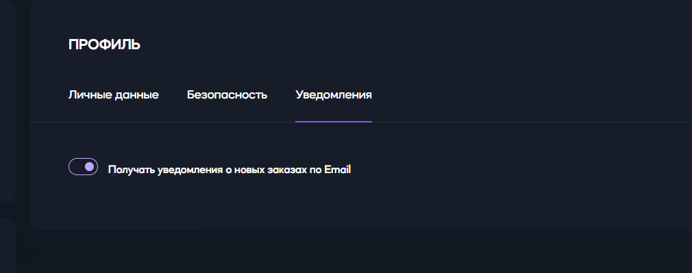

Реализовать новый дизайн сайта, полностью проверить и исправить
существующую верстку и функциональность, оптимизировать
производительность и безопасность, добавить новые возможности
(авторизация через Telegram, система отзывов, кнопка «Вверх» и др.), а
также привести весь контент и интерфейс в соответствие с брендом «Читы».

**Исходные данные:**

-   Ссылка на верстку нового дизайна:
    https://www.figma.com/design/kfmubZ3iTMjTywiS3Q6boL/payson-keys?node-id=0-1&p=f&t=EKvjekRaWTNUAvjL-0

-   Логотип: использовать **текущий логотип сайта** (не логотип из
    нового дизайна).

**1. Дизайн и верстка (фронтенд)**

1.1. Выполнить полную верстку нового дизайна по предоставленной ссылке.
1.2. Сохранить текущий логотип сайта (не заменять на логотип из макета).
1.3. Обеспечить **полную адаптивность** на всех устройствах (мобильные,
планшеты, десктопы). Всё должно отображаться корректно, без
горизонтальной прокрутки и визуальных ошибок. 1.4. Провести полную
ревизию **существующей верстки** сайта и исправить все недочёты (самый
приоритетный пункт). 1.5. В разделе «Статус читов» (карточки категорий):

-   Убрать изображение карточки категории.

-   Оставить только название категории и список товаров.

-   {width="4.418181321084864in"
    height="3.4217629046369202in"}

-   1.6. Изменить **все кнопки** на сайте: сделать их современными,
    приятными визуально и интуитивно понятными (единый стиль,
    hover-эффекты, правильные размеры и отступы).

-   {width="4.661299212598426in"
    height="0.9272725284339458in"}

-   1.7. Убрать **все фоновые изображения** на сайте. 1.8. Добавить
    современные **анимации и подсветки** (плавные переходы,
    hover-эффекты, микровзаимодействия) в соответствии с новым дизайном.

-   1.9. Добавить кнопку **«Вверх»** (back-to-top) в правом нижнем углу
    для быстрого возврата наверх страницы.

-   {width="1.291505905511811in"
    height="1.463636264216973in"}

**2. Переработка конкретных блоков**

2.1. Страница **«О нас»**:

-   Переработать блок со ссылками на социальные сети: сделать чёткое
    разделение, заменить иконки, привести цвета иконок и стили в
    соответствие с цветовой палитрой сайта.

-   {width="6.5in" height="1.0638888888888889in"}

-   Ниже блок «История проекта» соответствие с цветовой палитрой сайта.

-   {width="6.490972222222222in"
    height="1.554861111111111in"}

**3. Контент и тексты**

3.1. По всему сайту заменить слово **«СОФТ»** на **«ЧИТЫ»** (читы, чит,
читов и т.д.).

-   Обеспечить правильное склонение и гармоничное звучание во всех
    падежах и формах.

**4. Функциональность и бизнес-логика**

4.1. **Система оплаты:**

-   Полностью проверить работоспособность всех способов оплаты,
    интегрированных предыдущим разработчиком.

-   Реализовать/доработать кнопку **«Проверить платеж»**

4.2. **Бронирование товаров:**

-   Проверить логику бронирования товара при создании заказа.

-   Проверить логику отмены заказа и возврата товара на склад.

-   Исправить все выявленные ошибки.

4.3. **Реферальная система:**

-   Полная проверка работоспособности.

-   Исправление всех найденных багов.

4.4. **Авторизация:**

-   Добавить авторизацию пользователей через **Telegram**.

-   В личном кабинете → вкладка **«Безопасность»** добавить отображение
    всех способов авторизации (Telegram, почта, Яндекс). Если
    пользователь заходил через Telegram --- этот способ должен
    отображаться.

-   {width="6.490972222222222in"
    height="3.345138888888889in"}

4.5. **Уведомления клиентов:**

-   Проверить работу уведомлений о покупках (email / Telegram / внутри
    сайта).

-   {width="6.490972222222222in"
    height="2.563888888888889in"}

-   Исправить все ошибки, если уведомления не приходят или приходят
    некорректно.

4.6. **Система отзывов (новая функциональность):**

-   Пользователь может оставить отзыв → отзыв попадает на модерацию в
    админ-панель.

-   В админке должна быть возможность **опубликовать** или **удалить**
    отзыв.

4.7. **Многоязычность:**

-   Проверить и исправить работу перевода сайта на **английский язык**
    (все страницы, строки, формы).

**5. Оптимизация и производительность**

5.1. Ускорить работу сайта. 5.2. Провести аудит скорости загрузки всех
страниц. 5.3. Выявить и устранить все ошибки, тормозящие загрузку
(изображения, скрипты, CSS, базы данных и т.д.).

**6. Безопасность**

6.1. Провести проверку сайта на уязвимость к **DDoS-атакам**. 6.2. Если
текущая защита недостаточна --- внедрить/настроить надежную защиту
(Которая работает в России, встроенные средства сервера или иное решение
по согласованию).

**7. Требования к сдаче работ**

-   После завершения --- полный регрессионный тест ключевых функций
    (авторизация, оплата, бронирование, отзывы, реферальная система).

-   Предоставить отчёт о выполненных работах и исправленных ошибках.

-   Код должен соответствовать стандартам (чистота, комментарии,
    отсутствие «мусора»).

-   Сайт должен работать стабильно после всех изменений.
