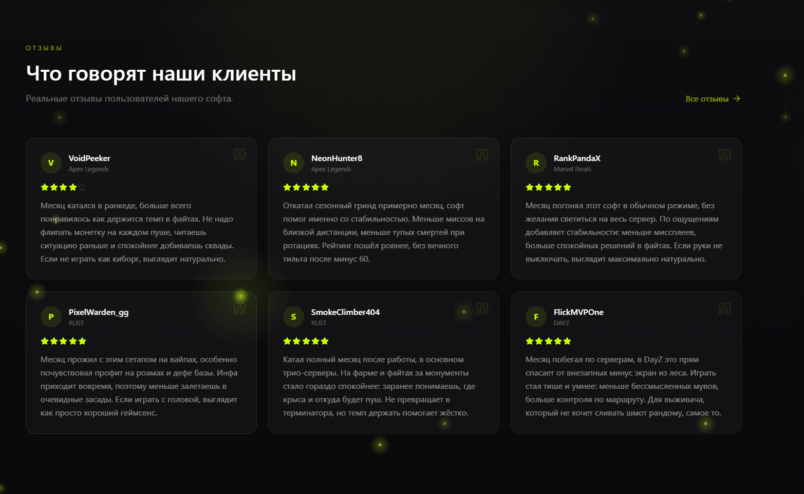
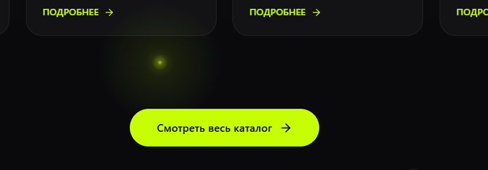
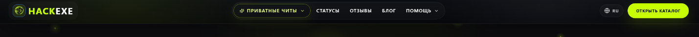

**Цель:** Обновить интерфейс сайта в соответствии с современными
требованиями к UX/UI, сохранив при этом текущий фирменный цветовой
стиль. Все изменения должны быть полностью адаптивными (мобильные
устройства, планшеты, десктопы всех разрешений).

**1. Блок отзывов на главной странице**

-   Полностью сменить дизайн блока «Отзывы».

-   **Пример для копирования:** \[https://hackexe.com/ru\].

-   {width="6.490972222222222in"
    height="3.990972222222222in"}

-   Сохранить текущие цвета, шрифты и общую стилистику сайта.

-   Добавить под блоком отзывов кнопку **«Смотреть все отзывы»**,
    которая ведёт на новую страницу «Отзывы».

-   {width="6.490972222222222in"
    height="2.263888888888889in"}

**2. Новая страница «Отзывы»**

-   Создать отдельную страницу «Отзывы».

-   **Пример для копирования:** https://hackexe.com/ru/reviews

**3. Новая страница «Каталог игр»**

-   Создать отдельную страницу «Каталог игр» (полный список игр).

-   **Пример для копирования:** \[https://hackexe.com/ru/games\].

-   На странице обязательно разместить:

    -   Фильтры по платформам (Мобильные игры / ПК игры) --- именно сюда
        переносится фильтр, который сейчас находится на главной
        странице.

    -   Поиск по играм.

    -   Сетку карточек игр (адаптивную).

    -   Сортировку (по популярности, новизне и т.д.).

**4. Главная страница --- изменения**

-   Под блоком карточек категорий добавить кнопку **«Смотреть весь
    каталог»**. Кнопка должна вести на новую страницу «Каталог игр».

-   {width="6.490972222222222in"
    height="2.263888888888889in"}

-   Убрать с главной страницы фильтр выбора «Мобильные игры / ПК игры
    перенести ее в каталог с играми».

-   Под блоком отзывов оставить кнопку **«Смотреть все отзывы»** (см. п.
    1).

**5. Шапка сайта (Header)**

-   Полностью переработать шапку сайта (современный, чистый и удобный
    вид).

-   Добавить в шапку новую кнопку **«Отзывы»**.

-   **Стиль** --- копировать с
    {width="6.490972222222222in"
    height="0.3548611111111111in"}

-   Переработать кнопку **«Каталог читов»** на главной странице

**6. Общие требования**

-   **Цветовая схема:** строго использовать текущий фирменный стиль
    сайта (цвета, градиенты, акцентные цвета --- без изменений).

-   **Адаптивность:** все новые и изменённые элементы должны идеально
    отображаться на всех устройствах
